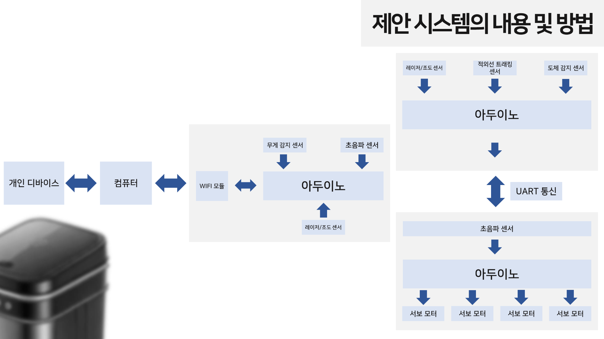
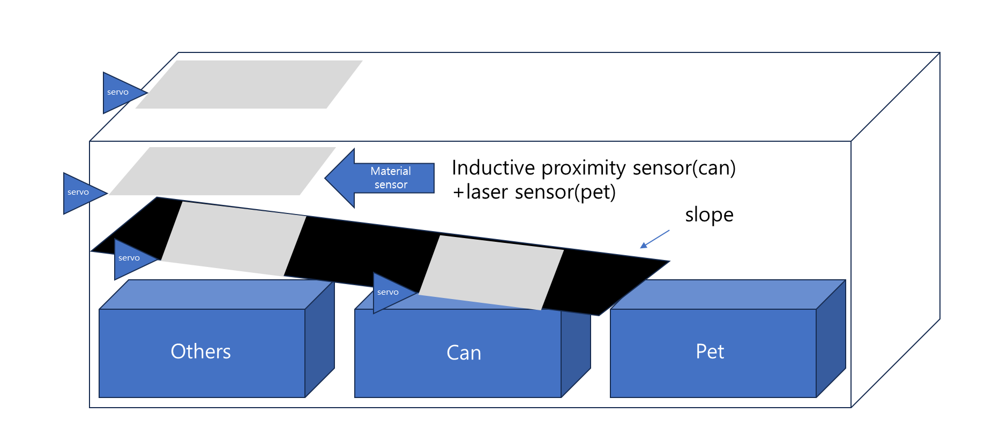
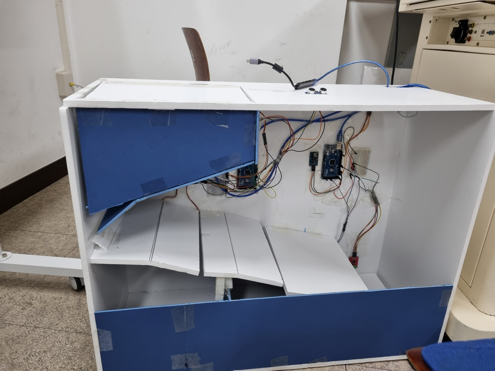

# Smart Trashbin

\* 본 프로젝트는 부산대학교 어드벤처디자인 텀프로젝트 과제로 제출되었습니다.

쓰레기 재질을 인식해 자동으로 쓰레기를 분류하는 쓰레기통입니다. 

## 주요 기능
- 캔, 페트, 일반 쓰레기 분류 가능
- 사용자 근접 시 자동 개폐 기능
- 쓰레기 데이터 수집, 서버로 전송

## 작동 과정

아두이노 3개를 이용해 쓰레기 센서부, 모터부, 쓰레기통 센서부로 구성

1. 쓰레기 센서부
    - 적외선 트래킹 센서로 물체 감지
    - 유도형 근접 센서로 물체 측정
    - 레이저 / 포토레지스터로 물체 투명도 측정
    - 측정 결과에 따라 모터부에 UART 통신으로 신호 전달
        - 금속 물체 : 캔 쓰레기
        - 투명한 물체 : 페트 쓰레기
        - 나머지 : 일반 쓰레기
2. 모터부
    - UART 통신을 통해 모터 작동 데이터를 받아 수행
    - 초음파 센서를 통해 쓰레기통 뚜껑 개폐
3. 쓰레기통 센서부
    - 초음파 센서, ToF 센서를 이용해 거리 측정
        - 전체 쓰레기통 높이 기준 백분율로 변환
    - 로드 셀 센서와 증폭기로 페트 쓰레기 무게 측정
    - 와이파이 모듈 사용해 서버로 전송
4. 웹서버버

## 사용한 장치
- 로드 셀, 증폭기
- 레이저, 포토레지스터
- WIFI 모듈
- ToF 모듈
- 초음파 모듈
- 유도형 근접 센서
- 서보 모터

## 결과

